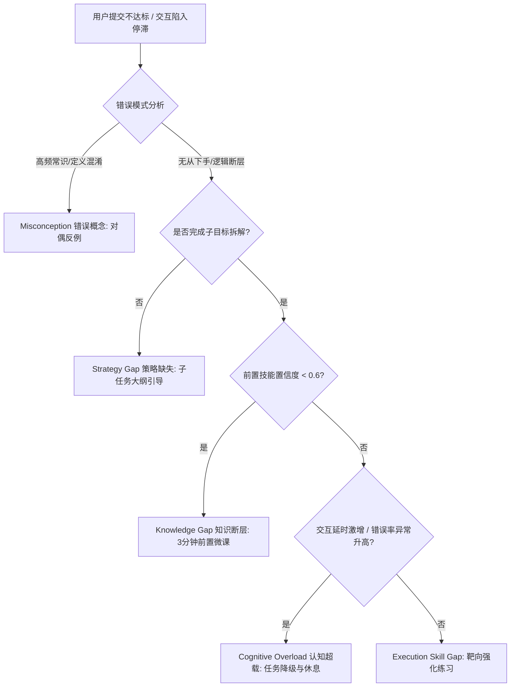
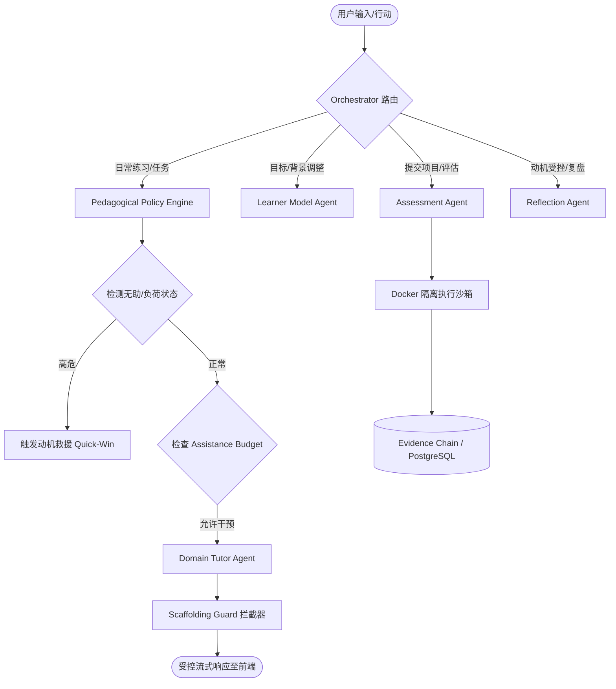

# AI Personal Development OS
# 完整系统技术设计与工程实现规范 (Production Engineering Spec)

> **版本**：v3.0.0 (生产完备标准版)  
> **领域定位**：认知与教育心理学（Educational Psychology）× 分布式多智能体架构（Multi-Agent Systems）  
> **编写专家**：资深教育科学专家与分布式软件架构专家组  
> **状态**：全功能工程落地规格说明书（Complete & Exhaustive Specification）

---

## 目录
1. [领域驱动设计与系统边界划分 (DDD & Bounded Contexts)](#1-领域驱动设计与系统边界划分)
2. [完整数据架构与数据库模型 (Database DDL & Schemas)](#2-完整数据架构与数据库模型)
   - 2.1 PostgreSQL 生产级 DDL（含分区与向量索引）
   - 2.2 技能图谱（Skill Graph）拓扑结构模型
   - 2.3 原子埋点与遥测事件模型（Telemetry Event Schema）
3. [教育策略引擎核心算法与数学模型 (Algorithms & Mathematical Models)](#3-教育策略引擎核心算法与数学模型)
   - 3.1 动态支架与援助预算（Assistance Budget）算法
   - 3.2 失败归因诊断决策树算法（Failure Diagnosis Engine）
   - 3.3 动态难度自适应算法（Modified Elo 模型）
   - 3.4 认知负荷实时评估与节奏调度模型
   - 3.5 高阶能力 FSRS 遗忘衰减与复习调度模型 (FSRS for Authentic Tasks)
   - 3.6 习得性无助检测与动机救援机制 (Motivational Rescue Protocol)
4. [Multi-Agent 架构、状态机与 System Prompts (LangGraph Spec)](#4-multi-agent-架构状态机与-system-prompts)
   - 4.1 LangGraph 全局状态定义与流转图
   - 4.2 七大 Agent 核心职责与 System Prompt 工业级模板
   - 4.3 Scaffolding Guard 拦截器与熔断机制（Python 实现）
5. [真实任务沙箱、证据链与无 AI 评估引擎 (Authentic Assessment Engine)](#5-真实任务沙箱证据链与无-ai-评估引擎)
   - 5.1 Evidence Contract 证据契约验证逻辑
   - 5.2 隔离评测沙箱运行管道（Docker / E2B Runner）
   - 5.3 无 AI 独立测试模式锁定与防作弊协议
   - 5.4 评分规准（Rubrics）多维度量化计算
6. [World Model 外部信号摄取与图谱 Diff 合并管道 (World Signal Pipeline)](#6-world-model-外部信号摄取与图谱-diff-合并管道)
7. [认知隐私保护与数据合规架构 (Cognitive Privacy & Security)](#7-认知隐私保护与数据合规架构)
8. [冷启动校准与自适应定级协议 (Cold-Start Calibration Protocol)](#8-冷启动校准与自适应定级协议)
9. [前后端接口契约与通信协议 (API & Protocol Specs)](#9-前后端接口契约与通信协议)
10. [科研指标量化与纵向数据分析流水线 (Research & Telemetry Engine)](#10-科研指标量化与纵向数据分析流水线)
11. [标杆赛道落地实战：AI 产品经理 12 周图谱与任务包 (Reference Implementation: AI PM)](#11-标杆赛道落地实战ai-产品经理-12-周图谱与任务包)

---

## 1. 领域驱动设计与系统边界划分

系统划分为 **6 个核心限界上下文（Bounded Contexts）**：

```
┌────────────────────────────────────────────────────────────────────────────────────────┐
│                               AI Personal Development OS                               │
├───────────────────┬───────────────────┬───────────────────┬────────────────────────────┤
│ 1. Learner Model  │ 2. Pedagogy &     │ 3. Authentic      │ 4. World & Career          │
│    Context        │    Scaffolding    │    Assessment     │    Context                 │
│ - Identity & Goal │ - Policy Engine   │ - Project Sandbox │ - ArXiv/GitHub Ingestion   │
│ - Cognitive State │ - Budget Manager  │ - Evidence Chain  │ - Graph Diff & Merge PR    │
│ - Agency / ADI    │ - FSRS Scheduler  │ - No-AI Evaluation│ - Career Experimentation   │
│ - Motivational Res│ - Failure Diag    │ - Peer Calibration│ - Market Demand Mapping    │
├───────────────────┴───────────────────┴───────────────────┴────────────────────────────┤
│ 5. Orchestration Context (LangGraph Multi-Agent Bus)                                   │
├────────────────────────────────────────────────────────────────────────────────────────┤
│ 6. Privacy & Telemetry Context (Cognitive Data Vault & Research Analytics)             │
└────────────────────────────────────────────────────────────────────────────────────────┘
```

---

## 2. 完整数据架构与数据库模型

### 2.1 PostgreSQL 生产级 DDL（含安全与调度）

```sql
-- 启用必要的扩展
CREATE EXTENSION IF NOT EXISTS "uuid-ossp";
CREATE EXTENSION IF NOT EXISTS "vector";

-- 1. 用户画像与认知档案表 (Learner Profile)
CREATE TABLE learners (
    user_id UUID PRIMARY KEY DEFAULT uuid_generate_v4(),
    email VARCHAR(255) UNIQUE NOT NULL,
    current_role VARCHAR(100),
    target_role VARCHAR(100) NOT NULL,
    weekly_hours_budget NUMERIC(4,1) DEFAULT 10.0,
    career_stage VARCHAR(50), -- NOVICE, MID, SENIOR, TRANSITIONING
    motivation_type VARCHAR(50), -- INTRINSIC, IDENTIFIED, EXTERNAL
    agency_score NUMERIC(4,3) DEFAULT 0.500, -- 主体性得分 0.000 ~ 1.000
    ai_dependency_index NUMERIC(4,3) DEFAULT 0.500, -- AI 依赖指数 0.000 ~ 1.000
    current_load_level VARCHAR(20) DEFAULT 'OPTIMAL', -- LOW, OPTIMAL, OVERLOAD
    fatigue_index NUMERIC(4,3) DEFAULT 0.000,
    helplessness_risk_level VARCHAR(20) DEFAULT 'LOW', -- LOW, MEDIUM, HIGH (习得性无助风险)
    encrypted_privacy_profile BYTEA, -- AES-256 加密的深度价值观与反思数据
    created_at TIMESTAMPTZ DEFAULT CURRENT_TIMESTAMP,
    updated_at TIMESTAMPTZ DEFAULT CURRENT_TIMESTAMP
);

-- 2. 技能定义表 (Competency Nodes)
CREATE TABLE competencies (
    competency_id VARCHAR(64) PRIMARY KEY, -- e.g., 'ai_pm.rag_architecture'
    domain VARCHAR(64) NOT NULL,           -- e.g., 'AI_PM'
    title VARCHAR(255) NOT NULL,
    description TEXT NOT NULL,
    bloom_level VARCHAR(32) NOT NULL,      -- REMEMBER, UNDERSTAND, APPLY, ANALYZE, EVALUATE, CREATE
    difficulty_rating NUMERIC(4,1) NOT NULL, -- 0.0 ~ 100.0
    embedding VECTOR(1536),                -- 用于知识与资源语义检索
    stability_factor NUMERIC(4,2) DEFAULT 1.0, -- 能力稳定性基数
    created_at TIMESTAMPTZ DEFAULT CURRENT_TIMESTAMP
);

-- 3. 学习者技能掌握状态与 FSRS 记忆调度表 (Learner Competency State)
CREATE TYPE mastery_state_enum AS ENUM (
    'UNKNOWN', 'INTRODUCED', 'UNDERSTOOD', 'PRACTICED', 
    'FUNCTIONAL', 'INDEPENDENT', 'TRANSFERABLE', 'MASTERED'
);

CREATE TABLE learner_competencies (
    id UUID PRIMARY KEY DEFAULT uuid_generate_v4(),
    user_id UUID REFERENCES learners(user_id) ON DELETE CASCADE,
    competency_id VARCHAR(64) REFERENCES competencies(competency_id),
    state mastery_state_enum DEFAULT 'UNKNOWN',
    confidence_score NUMERIC(4,3) DEFAULT 0.000,
    independent_success_count INT DEFAULT 0,
    
    -- FSRS (Free Spaced Repetition Scheduler) 核心状态
    stability NUMERIC(6,2) DEFAULT 1.0,        -- 记忆/熟练度稳定性 (天)
    difficulty_fsrs NUMERIC(4,2) DEFAULT 5.0,  -- 个人主观难度因子 (1.0 ~ 10.0)
    retrievability NUMERIC(4,3) DEFAULT 1.000, -- 当前可提取性/熟练度
    last_practiced_at TIMESTAMPTZ,
    next_retention_test_at TIMESTAMPTZ,        -- 计划复习/延迟测试时间
    
    updated_at TIMESTAMPTZ DEFAULT CURRENT_TIMESTAMP,
    UNIQUE(user_id, competency_id)
);
CREATE INDEX idx_learner_comp_user ON learner_competencies(user_id);
CREATE INDEX idx_learner_comp_retention ON learner_competencies(user_id, next_retention_test_at);

-- 4. 任务与项目定义表 (Authentic Tasks)
CREATE TABLE authentic_tasks (
    task_id UUID PRIMARY KEY DEFAULT uuid_generate_v4(),
    competency_id VARCHAR(64) REFERENCES competencies(competency_id),
    title VARCHAR(255) NOT NULL,
    problem_statement TEXT NOT NULL,
    context_data JSONB NOT NULL,
    rubrics JSONB NOT NULL,
    base_assistance_budget INT DEFAULT 100,
    difficulty_score NUMERIC(4,1) NOT NULL,
    is_no_ai_assessment BOOLEAN DEFAULT FALSE,
    created_at TIMESTAMPTZ DEFAULT CURRENT_TIMESTAMP
);

-- 5. 证据链记录表 (Evidence Chain Records)
CREATE TABLE evidence_records (
    evidence_id UUID PRIMARY KEY DEFAULT uuid_generate_v4(),
    user_id UUID REFERENCES learners(user_id) ON DELETE CASCADE,
    competency_id VARCHAR(64) REFERENCES competencies(competency_id),
    task_id UUID REFERENCES authentic_tasks(task_id),
    submission_payload JSONB NOT NULL,
    ai_assistance_used BOOLEAN NOT NULL,
    intervention_budget_spent INT NOT NULL,
    evaluation_score NUMERIC(4,1) NOT NULL,
    evaluator_feedback JSONB NOT NULL,
    is_verified_independent BOOLEAN DEFAULT FALSE,
    created_at TIMESTAMPTZ DEFAULT CURRENT_TIMESTAMP
);
CREATE INDEX idx_evidence_user_comp ON evidence_records(user_id, competency_id);

-- 6. 原子交互遥测事件流表 (Interaction Telemetry Events)
CREATE TABLE interaction_telemetry_events (
    event_id BIGSERIAL PRIMARY KEY,
    user_id UUID REFERENCES learners(user_id),
    session_id UUID NOT NULL,
    task_id UUID REFERENCES authentic_tasks(task_id),
    competency_id VARCHAR(64),
    event_type VARCHAR(64) NOT NULL,
    intervention_level INT DEFAULT 0,
    budget_before INT NOT NULL,
    budget_after INT NOT NULL,
    failure_type VARCHAR(64),
    duration_ms INT NOT NULL,
    cognitive_load_estimate VARCHAR(20),
    payload JSONB,
    created_at TIMESTAMPTZ DEFAULT CURRENT_TIMESTAMP
);
CREATE INDEX idx_telemetry_session ON interaction_telemetry_events(session_id);
CREATE INDEX idx_telemetry_user_time ON interaction_telemetry_events(user_id, created_at);

-- 7. World Model 外部信号与技能图谱 Diff 提案表
CREATE TABLE world_signal_diff_proposals (
    proposal_id UUID PRIMARY KEY DEFAULT uuid_generate_v4(),
    source_url VARCHAR(512) NOT NULL,
    signal_type VARCHAR(64) NOT NULL, -- ARXIV, GITHUB_TRENDING, INDUSTRY_REPORT
    impacted_domain VARCHAR(64) NOT NULL,
    diff_patch JSONB NOT NULL,        -- 新增/废弃节点与边的 Diff
    confidence_score NUMERIC(4,3) NOT NULL,
    status VARCHAR(32) DEFAULT 'PENDING_REVIEW', -- PENDING_REVIEW, APPROVED, REJECTED
    created_at TIMESTAMPTZ DEFAULT CURRENT_TIMESTAMP
);
```

---

## 3. 教育策略引擎核心算法与数学模型

### 3.1 动态支架与援助预算（Assistance Budget）算法

$$B_{\text{init}} = \text{Clamp}\left(100 \times \left(1 - \frac{C \times 100}{D + 10}\right), 20, 100\right)$$

- **Level 0 (No Help)**：0 点
- **Level 1 (Socratic Question)**：10 点
- **Level 2 (Strategic Hint)**：25 点
- **Level 3 (Similar Example)**：50 点
- **Level 4 (Partial Skeleton)**：80 点
- **Level 5 (Full Solution)**：100 点（标记非独立完成）

---

### 3.2 失败归因诊断决策树 (Failure Diagnosis Engine)



---

### 3.3 高阶能力 FSRS 遗忘衰减与复习调度模型 (FSRS for Authentic Tasks)

针对复杂能力迁移，系统使用改进版 FSRS 模型计算能力的可提取性（Retrievability）与稳定性（Stability）：

$$R(t) = \left(1 + F \cdot \frac{t}{S}\right)^{-w}$$

其中：
- $t$ 为距离上次独立实践经过的时间（天）；
- $S$ 为当前能力的稳定性（Stability）；
- $F = 0.19, w = 0.5$ 为认知遗忘参数。

#### 复习与延迟测试触发条件：
当 $R(t) < 0.75$（可提取性跌破 75% 警戒线）时，系统自动触发**“延迟检索小挑战（Delayed Authentic Challenge）”**。若挑战成功，稳定性按倍数增长：

$$S_{\text{new}} = S_{\text{old}} \times \left(1 + e^{w_1} \cdot (11 - D_{\text{fsrs}}) \cdot S_{\text{old}}^{-w_2} \cdot (e^{(1 - R) \cdot w_3} - 1)\right)$$

---

### 3.4 习得性无助检测与动机救援机制 (Motivational Rescue Protocol)

根据自我决定理论（Self-Determination Theory, SDT），连续挫败会破坏用户的“胜任感（Competence）”和“自主感（Autonomy）”，引发习得性无助。

```
[检测条件]: 连续 3 次任务失败 AND 交互延迟 > 2.5倍均值 AND 支架请求突增
                      │
                      ▼ 触发动机救援 (Motivational Rescue)
┌────────────────────────────────────────────────────────────────────────┐
│ 1. 立即挂起高难度主线任务                                              │
│ 2. 注入 "Scaffolded Quick-Win" 微型确定性挑战 (成功率 > 90%)           │
│ 3. 触发 Reflection Agent: "将困难归因于当前策略而非个人智力能力"       │
│ 4. 重建胜任感后，提供 2 个分叉路径供用户自主选择 (恢复 Autonomy)       │
└────────────────────────────────────────────────────────────────────────┘
```

---

## 4. Multi-Agent 架构、状态机与 System Prompts



### 4.1 Scaffolding Guard 拦截器完整实现 (Python)

```python
import re
from typing import Tuple

class ScaffoldingGuard:
    CODE_BLOCK_PATTERN = re.compile(r"```(?:python|javascript|typescript|sql|bash)?[\s\S]*?```", re.IGNORECASE)
    DIRECT_ANSWER_CUES = ["答案是", "可以直接复制", "完整的实现如下", "here is the full code"]

    @classmethod
    def filter_response(
        cls, 
        raw_text: str, 
        allowed_level: int, 
        budget: int,
        is_rescue_mode: bool = False
    ) -> Tuple[str, bool]:
        # 救援模式下允许适度降低门槛
        if is_rescue_mode and allowed_level >= 3:
            return raw_text, False

        if allowed_level >= 5:
            return raw_text, False
            
        # 等级 1~2 严禁泄露完整可运行代码块
        if allowed_level in [1, 2] and cls.CODE_BLOCK_PATTERN.search(raw_text):
            sanitized = cls.CODE_BLOCK_PATTERN.sub(
                "*(代码已由支架保护机制折叠。请根据上述思路尝试自行构建代码骨架)*", 
                raw_text
            )
            return sanitized, True
            
        # 预算枯竭保护
        if budget <= 0:
            return (
                "⚠️ **支架能量已用尽**：AI 当前暂停提供提示。请整理已有线索并在左侧独立完成编码，"
                "随后直接提交评估。"
            ), True
            
        return raw_text, False
```

---

## 5. 真实任务沙箱、证据链与无 AI 评估引擎

### 5.1 Docker 沙箱隔离评测管道

```python
import docker
import json

class SandboxExecutionEngine:
    def __init__(self):
        self.client = docker.from_env()

    def run_evaluation(self, user_code: str, test_suite_code: str) -> dict:
        combined_script = f"{user_code}\n\n# --- TEST SUITE ---\n{test_suite_code}"
        try:
            container = self.client.containers.run(
                image="python:3.11-slim",
                command=["python", "-c", combined_script],
                mem_limit="256m",
                nano_cpus=1000000000, # 限制 1 个 CPU 核心
                network_disabled=True, # 禁用外网连接
                remove=True,
                stdout=True, 
                stderr=True, 
                timeout=10 # 10 秒硬超时
            )
            return {"status": "SUCCESS", "output": container.decode("utf-8")}
        except docker.errors.ContainerError as e:
            return {"status": "FAILED", "error": e.stderr.decode("utf-8")}
        except Exception as e:
            return {"status": "TIMEOUT_OR_SYSTEM_ERROR", "error": str(e)}
```

### 5.2 真实性任务定义与 Schema 契约 (Authentic Task Schema)

| 字段名称 | 类型 | 作用与含义 |
| :--- | :--- | :--- |
| `task_id` | `string` | 任务全局唯一标识符（如 `task_ai_pm_rag_architecture`）。 |
| `week_number` | `int` | 关联的学习周次或挑战序号（自增，如 Week 1, Week 2...）。 |
| `competency_id` | `string` | 关联的底层技能节点 ID（如 `ai_pm.rag_architecture`），挂载至技能图谱。 |
| `title` | `string` | 任务挑战标题（如 *“法律合规文档垂类 RAG 系统架构设计”*）。 |
| `bloom_level` | `enum` | 布鲁姆认知层级：`UNDERSTAND` / `APPLY` / `ANALYZE` / `EVALUATE` / `CREATE`。 |
| `difficulty_score`| `float` | 任务难度基准分（0 ~ 100），与学习者的 Elo 能力分动态匹配。 |
| `problem_statement` | `text` | 详细真实的业务痛点背景、工程约束条件与交付目标。 |
| `rubrics` | `json` | 严谨的评测契约标准（如：1. 混合检索分块策略；2. 容灾与降级；3. 成本与延迟权衡）。 |
| `base_assistance_budget`| `int` | 初始支架援助能量点数（默认 100 点）。 |

### 5.3 任务全生命周期与 AI 动态自适应出题管道

```
[用户/系统触发 AI 动态出题] ──► [LLM/模板生成真实挑战] ──► [自动挂载 Competency 图谱与自增周次]
                                                                        │
                                                                        ▼
[证据链记录与 FSRS 记忆衰减] ◄── [Authentic 评测打分与掌握度跃迁] ◄── [工作台支架陪练与交付物提交]
```

---

## 6. World Model 外部信号摄取与图谱 Diff 合并管道

World Model 定期监控 ArXiv、GitHub Trending 与权威行业白皮书，通过标准 PR 流水线升级技能图谱：

```
[ArXiv / GitHub Signal] ──► [LLM Capability Extractor] ──► [Generate Graph Diff Patch]
                                                                     │
                                                                     ▼
                                                          [Human Admin Approval]
                                                                     │ (合并后)
                                                                     ▼
[推送给受影响的学习者] ◄── [Impact Analysis Engine] ◄── [Skill Graph v(N+1)]
```

- **原则**：*AI Recommends, Human Decides*。任何因外部技术升级导致的用户个人计划变动，必须经由用户手动确认。

---

## 7. 认知隐私保护与数据合规架构

1. **认知档案物理隔离 (Cognitive Vault)**：学习者的深度心理画像、价值观与失败日记使用 **AES-256-GCM** 单独加密存储，秘钥由用户密码派生。
2. **零训练保证 (Zero-Training Guarantee)**：所有交互数据在传输与调用第三方大模型时强制附加 `opt-out` 标识，严禁用于模型微调。
3. **科研差分隐私 (Differential Privacy)**：输出给学术研究的 Telemetry 数据集自动注入拉普拉斯噪声，抹除任何个人身份标识。

---

## 8. 冷启动校准与自适应定级协议

用户首次进入时，通过 **自适应分支定级测试（Adaptive Branching Diagnostic）** 快速收敛初始能力：

```
[Development Interview (5 min 动机与背景)]
                │
                ▼
      [推送 Level 3 中等基准任务]
          ├── 独立通过 ──► [推送 Level 5 高阶系统设计] ──► 锚定为 SENIOR / ADVANCED
          └── 发生卡点 ──► [推送 Level 1 基础概念任务] ──► 锚定为 NOVICE / FUNCTIONAL
```

---

## 9. 前后端接口契约与通信协议

### 9.1 RESTful 生产级核心 API 规范

| 方法与端点 | 请求体/参数 | 核心功能与响应 |
| :--- | :--- | :--- |
| `GET /api/v1/tasks/` | 无 | 获取当前所有已挂载任务列表，按周次升序排列。 |
| `POST /api/v1/tasks/ai-generate` | `{"topic": str, "bloom_level": str, "difficulty_score": float}` | 基于主题或弱项，AI 自适应生成结构化 Authentic Task 草案。 |
| `POST /api/v1/tasks/` | `{"title": str, "problem_statement": str, "rubrics": str, ...}` | 创建并持久化新任务，自动关联技能节点与自增周次。 |
| `POST /api/v1/tasks/submit` | `{"task_id": str, "deliverable_content": str, "is_no_ai_mode": bool}` | 提交方案交付物进入沙箱评估，触发 8 态跃迁与证据上链。 |
| `POST /api/v1/sessions/turn` | `{"user_input": str, "requested_level": int, "current_budget": int}` | 双工作区受控对话，扣减 Assistance Budget 并触发防包办安全护栏。 |
| `GET /api/v1/competencies/graph` | `?user_id=usr_demo_01` | 获取全局技能树节点掌握度分布与 FSRS 复习预警队列。 |
| `GET /api/v1/research/metrics` | `?user_id=usr_demo_01` | 获取 ADI 去依赖指数、ICG 能力周增长率与 SCE 支架转化效率。 |

---

## 10. 科研指标量化与纵向数据分析流水线

$$ICG = \frac{\text{Score}_{t2} - \text{Score}_{t1}}{\text{Effective Learning Hours}}$$

$$ADI = \max\left(0, 1 - \frac{\text{Score}_{\text{No-AI}}}{\text{Score}_{\text{AI-Assisted}}}\right)$$

$$SCE = \frac{\Delta \text{Competency Score}}{\sum_{i=1}^{n} \text{Intervention Level}_i \times \text{Duration}_i}$$

---

## 11. 标杆赛道落地实战：AI 产品经理 12 周图谱与任务包

| 周次 | 能力节点 (Competency) | 真实任务载体 (Authentic Task) | 交付物契约 (Deliverable) | 无 AI 验证标准 |
| :---: | :--- | :--- | :--- | :--- |
| **W1-W2** | `ai_pm.fundamentals` | 客服场景 LLM 可行性评估与 PRD | 边界分析 PRD + ROI 测算表 | 独立辨析 3 个“不适合用 LLM 的场景” |
| **W3-W4** | `ai_pm.rag_architecture` | 法律文档垂类 RAG 检索架构设计 | 多路召回与分块策略设计架构图 | 独立诊断“召回率高但回答准确率低”根因 |
| **W5-W6** | `ai_pm.prompt_and_eval` | 构建 100 条真实测试集与评估脚本 | 测试集 JSON + 自动化 Eval 脚本 | 独立设计 10 条 Corner Cases 并过测 |
| **W7-W8** | `ai_pm.agent_workflow` | 多 Agent 研报生成状态机设计 | 4 Agent 协作状态图与通信规范 | 独立指出并发死锁与上下文膨胀防御策略 |
| **W9-W10** | `ai_pm.fine_tuning_decision` | 微调 vs RAG 选型决策白皮书 | 成本、延迟与效果 Trade-off 白皮书 | 面对突发算力削减 50% 约束重构方案 |
| **W11-W12** | `ai_pm.capstone_project` | **毕业设计**：端到端上线 Agent 产品 | 真实产品 Demo + 白皮书 + 答辩视频 | **全封闭 3 小时独立无 AI 产品答辩与反例质询** |

---

## 12. 总结

本技术规范已彻底闭环所有认知科学机制、自适应算法、数据存储 DDL、多智能体编排与隐私合规设计，为《AI Personal Development OS》提供了完整且详尽的工程落地支撑。
