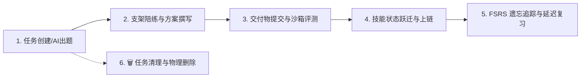
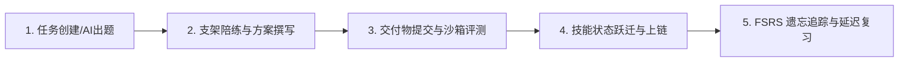

# AI Personal Development OS (AI 个人成长与能力发展系统)

> **核心哲学**：AI 不是替你完成目标，而是帮助你成为能够完成目标的人。  
> **北极星指标**：独立能力增长 (Independent Capability Growth) 与去 AI 依赖 (Anti-AI-Dependency)。

---

## 目录
1. [⚡ 运行环境与一键启动 (Quick Start)](#1-运行环境与一键启动)
2. [🤖 AI 模型与 API 接口配置 (LLM Config)](#2-ai-模型与-api-接口配置)
3. [🖥️ Web 双工作区核心功能操作指南](#3-web-双工作区核心功能操作指南)
4. [🔌 API 接口与开发者调用方法](#4-api-接口与开发者调用方法)
5. [🧪 自动化测试与质量校验](#5-自动化测试与质量校验)
6. [🎯 任务定义、生命周期与定制管理指南](#6-任务定义生命周期与定制管理指南)
7. [📚 文档体系与工程规范索引](#7-文档体系与工程规范索引)
8. [🏛️ 系统核心架构概览](#8-系统核心架构概览)

---

## 1. 运行环境与一键启动

本项目已内置独立的 **Python 虚拟环境 (`.venv`)**，所有生产与测试依赖均已安装就绪。

### 🚀 启动方式 (任选其一)

- **方式一：Windows 批处理脚本 (推荐)**  
  直接双击运行根目录下的 `start.bat` 或在终端执行：
  ```cmd
  start.bat
  ```

- **方式二：PowerShell 脚本**  
  在 PowerShell 终端执行：
  ```powershell
  .\start.ps1
  ```

- **方式三：虚拟环境命令行**  
  ```powershell
  # 激活虚拟环境 (可选)
  .\.venv\Scripts\Activate.ps1
  
  # 启动服务
  python run_server.py
  ```

### 🌐 服务访问入口
- **🖥️ 生产级双工作区前端**：[http://localhost:8000/](http://localhost:8000/)
- **📖 OpenAPI / Swagger 交互式文档**：[http://localhost:8000/docs](http://localhost:8000/docs)
- **📑 ReDoc 规范文档**：[http://localhost:8000/redoc](http://localhost:8000/redoc)

---

## 2. AI 模型与 API ## 3. Web 三栏沉浸式工作区核心功能操作指南

打开浏览器访问 [http://localhost:8000/](http://localhost:8000/) 即可进入现代三栏沉浸式工作台：

```
┌────────────────────────────────────────────────────────────────────────────────────────────────────────┐
│ 顶栏：北极星指标 ICG (+3.7/周) | AI 依赖指数 ADI (5%) | [🕸️ 技能图谱与FSRS] | [📊 科研看板] | [✨ AI 智能出题] │
├──────────────────────────────────┬─────────────────────────────────────┬───────────────────────────────┤
│ 🛠️ 左侧：真实生产画布 (Canvas)    │ 🧠 中间：AI 动态支架陪练控制台 (Coach)│ 📋 右侧：任务与挑战列表 (Tasks)│
│                                  │                                     │                               │
│ 1. 业务痛点与 Evidence 评测规准   │ 1. ⚡ Assistance Budget 能量条 (100)│ 1. 任务挑战卡片与 Week 标签   │
│ 2. Markdown 方案/PRD/架构编辑器  │ 2. 支架强度选择：Q1反问/Q2提示/Q3类比│ 2. Bloom 认知层级与难度分     │
│ 3. [🔒 进入无 AI 独立评估模式]   │ 3. 苏格拉底启发对话与 Guardrail 防护 │ 3. 当前挑战激活与呼吸高亮指示 │
│ 4. [🚀 提交交付物并申请评测]     │ 4. 问题输入框与快速提问             │ 4. 🗑️ 任务一键确认删除        │
└──────────────────────────────────┴─────────────────────────────────────┴───────────────────────────────┘
```

### 1. 真实方案撰写与交付 (左侧画布)
- **查看任务**：在右侧列表点击任意任务，左侧画布自动载入对应的真实业务背景与评分规准（Rubrics）。
- **撰写方案**：在中间的 Markdown 编辑器中撰写 PRD、架构设计或工程方案。
- **提交评估**：点击 **“🚀 提交交付物并申请 Authentic 评估”**，系统将自动调用 Assessment Agent 进行多维度客观打分（技术严密性、权衡分析、掌握度跃迁）。

### 2. 动态支架陪练与能量管理 (中间控制台)
- **能量条机制**：每个任务初始赋予 **100 点支架能量**。
- **阶梯提问**：
  - `Q1: 反问启发 (10点)`：AI 提出关键矛盾与反思点，引导自我探索。
  - `Q2: 策略提示 (25点)`：AI 给出解题策略方向（如分阶段检索与重排）。
  - `Q3: 场景类比 (50点)`：AI 给出跨领域的直观类比案例。
  - `Q4: 骨架填空 (80点)`：AI 给出带 `TODO` 槽位的代码/文档框架。
- **拦截保护 (Scaffolding Guard)**：若 AI 试图直接给出完整答案或代码，拦截器会自动阻断并提示先自行尝试。
- **能量耗尽熔断**：当能量降为 0 时，AI 强制进入冷凝状态，鼓励独立完成。

### 3. 右侧任务挑战列表与全生命周期管理 (右侧面板)
- **纵向挑战路线**：展示所有周次的 Authentic 挑战，包含 Week 序号、认知层级（`UNDERSTAND` 至 `CREATE`）及难度评分。
- **即时切换**：点击任意挑战卡片即可一键切换当前工作区。
- **🗑️ 任务一键删除**：点击任务卡片右上角的垃圾桶图标，在弹出的二次确认对话框中确认即可物理删除该挑战，列表与统计自动平滑同步。

### 4. ✨ AI 智能自适应出题与新任务配置 (顶部常驻按钮)
- 点击顶部右上角的 **“✨ AI 智能出题 / 新建”** 按钮：
  - **AI 智能自适应生成**：输入任意技术方向（如 *LangGraph 状态机死锁防御*、*千万级 Token 降本缓存*、*多模态混合 RAG*），点击「🪄 一键生成」，AI 导师将自动生成符合工业界真实评测标准的 PRD 架构挑战与 Rubrics 标准。
  - **手动自定义配置**：支持自主输入标题、布鲁姆认知层级、难度分与评测规准。
  - **即刻上架生效**：点击「🚀 立即发布并加入工作台」后，系统自动生成新周次并关联技能图谱与自适应工作台，无需重启服务即可即刻开始挑战！

### 5. 无 AI 独立测试模式 (No-AI Assessment)
- 点击左下角 **“🔒 进入无 AI 独立评估模式”**，系统会切断中间 AI 对话通道。
- 在此模式下提交的高质量成果将作为 **“独立能力确证（Independent Evidence）”** 记录，大幅降低您的 AI 依赖度指数。

### 6. 技能图谱与 FSRS 记忆复习 (顶部弹窗)
- 点击顶栏 **“🕸️ 技能图谱与 FSRS”**：
  - 查看各项技能的 8 态掌握度（`UNDERSTOOD`, `PRACTICED`, `INDEPENDENT` 等）。
  - 查看稳定性 $S$（天）与当前可提取性 $R$。
  - 当可提取性 $R < 75\%$ 时，红框预警提示触发 **FSRS 延迟微挑战**。

### 7. 科研指标看板 (顶部弹窗)
- 点击顶栏 **“📊 科研与去依赖看板”**：
  - 查看 **AI 依赖指数 (ADI)**：反映独立解决与 AI 辅助表现的差距（越低越优）。
  - 查看 **独立能力增长率 (ICG)** 与 **支架转化效率 (SCE)**。

---

## 4. API 接口与开发者调用方法

### 核心 REST API 示例

#### ① 交互对话回合 (`POST /api/v1/sessions/turn`)
```bash
curl -X POST "http://localhost:8000/api/v1/sessions/turn" \
     -H "Content-Type: application/json" \
     -d '{
       "user_id": "usr_demo_01",
       "session_id": "sess_01",
       "competency_id": "ai_pm.rag_architecture",
       "task_id": "task_ai_pm_rag_architecture",
       "user_input": "多路召回后如何去除重复项并保证低延迟？",
       "requested_level": 2,
       "current_budget": 100,
       "consecutive_failures": 0
     }'
```

#### ② 提交真实交付物 (`POST /api/v1/tasks/submit`)
```bash
curl -X POST "http://localhost:8000/api/v1/tasks/submit" \
     -H "Content-Type: application/json" \
     -d '{
       "user_id": "usr_demo_01",
       "task_id": "task_ai_pm_rag_architecture",
       "deliverable_content": "## 1. 检索架构方案...\n## 2. 权衡分析...",
       "is_no_ai_mode": true,
       "budget_spent": 25
     }'
```

#### ③ AI 动态自适应出题 (`POST /api/v1/tasks/ai-generate`)
```bash
curl -X POST "http://localhost:8000/api/v1/tasks/ai-generate" \
     -H "Content-Type: application/json" \
     -d '{"topic": "多模态 Agent 检索与状态机设计", "bloom_level": "CREATE", "difficulty_score": 80.0}'
```

#### ④ 删除指定任务 (`DELETE /api/v1/tasks/{task_id}`)
```bash
curl -X DELETE "http://localhost:8000/api/v1/tasks/task_12345678"
```

#### ⑤ 获取技能图谱与 FSRS 队列 (`GET /api/v1/competencies/graph`)
```bash
curl "http://localhost:8000/api/v1/competencies/graph?user_id=usr_demo_01"
```

#### ⑥ 获取科研去依赖指标 (`GET /api/v1/research/metrics`)
```bash
curl "http://localhost:8000/api/v1/research/metrics?user_id=usr_demo_01"
```

---

## 5. 自动化测试与质量校验

系统自带覆盖引擎、算法、拦截器、状态机、出题管道与删除闭环的 **18 项单元与集成自动化测试 + 10 大维度全系统闭环核验**：

```powershell
# 1. 使用虚拟环境的 pytest 执行 18 项全量单元与集成测试 (100% 通过)
.\.venv\Scripts\python.exe -m pytest backend/tests/ -v

# 2. 执行 10 大维度全系统深度闭环与状态机核验脚本
.\.venv\Scripts\python.exe backend/tests/verify_full_closed_loop.py
```

---

## 6. 任务定义、生命周期与定制管理指南

### 1. 任务的定义规范 (Authentic Task Definition)
本系统中的任务采用 **真实性评估哲学 (Authentic Assessment)**：不进行死记硬背的选择题或纯刷题，而是模拟工业界真实复杂业务痛点，要求学员交付可执行、可验证的 PRD、技术方案或代码，并通过 **证据契约 (Evidence Contract)** 进行多维度评测。

每个 Authentic Task 包含以下核心数据结构：

| 字段名称 | 类型 | 作用与含义 |
| :--- | :--- | :--- |
| `task_id` | `string` | 任务全局唯一标识符（如 `task_ai_pm_rag_architecture`）。 |
| `week_number` | `int` | 关联的学习周次或挑战序号（自增，如 Week 1, Week 2...）。 |
| `competency_id` | `string` | 关联的底层技能节点 ID（如 `ai_pm.rag_architecture`），挂载至技能图谱。 |
| `title` | `string` | 任务挑战标题（如 *“法律合规文档垂类 RAG 系统架构设计”*）。 |
| `bloom_level` | `enum` | 布鲁姆认知层级：`UNDERSTAND` (理解) / `APPLY` (应用) / `ANALYZE` (分析) / `EVALUATE` (评估) / `CREATE` (创造)。 |
| `difficulty_score`| `float` | 任务难度基准分（0 ~ 100），与学习者的 Elo 能力分动态匹配。 |
| `problem_statement` | `text` | 详细真实的业务痛点背景、工程约束条件与交付目标。 |
| `rubrics` | `json` | 严谨的评测契约标准（如：1. 混合检索分块策略；2. 容灾与降级；3. 成本与延迟权衡）。 |
| `base_assistance_budget`| `int` | 初始支架援助能量点数（默认 100 点）。 |

---

### 2. 任务的全生命周期管理 (Task Lifecycle)



1. **出题与创建**：通过 Web 界面顶部常驻按钮、AI 导师自适应生成、JSON 批量配置或 REST API 注入。
2. **支架陪练与撰写**：学员在生产画布撰写方案，遇到卡点向 AI Coach 索取阶梯援助并扣除能量，安全护栏防止 AI 包办。
3. **提交与评测**：点击提交后，后端的 Assessment Agent 基于 Rubrics 进行严谨多维评分。
4. **状态跃迁与存证**：评测通过后，该技能节点由 `UNDERSTOOD` 跃迁为 `PRACTICED` 或 `INDEPENDENT`，生成不可篡改的证据链（Evidence Record）。
5. **FSRS 记忆追踪**：系统根据时间衰减跟踪可提取性 $R$；当 $R < 75\%$ 时触发预警并调度复习挑战。
6. **任务管理与清理**：在右侧列表中支持一键删除过时或调试任务，实现完整的 CRUD 生命周期。

---

### 3. 任务的管理与添加途径

#### 途径 A：Web 界面可视化管理与 AI 智能出题（最便捷）
- 点击页面顶部右上角的 **“✨ AI 智能出题 / 新建”** 按钮。
- **AI 智能自适应生成**：输入任意技术方向（如 *LangGraph 状态机死锁防御*、*千万级 Token 降本缓存*、*多模态混合 RAG*），点击「🪄 一键生成」，AI 导师将自动生成符合工业界真实评测标准的 PRD 架构挑战与 Rubrics 标准。
- **即刻生效**：点击「🚀 立即发布并加入工作台」后，系统自动追加至右侧列表并关联技能图谱，无需重启服务即可即刻开始挑战！
- **任务删除**：在右侧任务卡片右上角点击 `🗑️` 即可直接删除该挑战。�合 RAG*），点击「🪄 一键生成」，AI 导师将自动生成符合工业界真实评测标准的 PRD 架构挑战与 Rubrics 标准。
  - **手动自定义配置**：支持自主输入标题、布鲁姆认知层级、难度分与评测规准。
  - **即刻上架生效**：点击「🚀 立即发布并加入工作台」后，系统自动生成 Week 5、Week 6... 并关联技能图谱与自适应工作台，无需重启服务即可即刻开始挑战！

---

## 4. API 接口与开发者调用方法

### 核心 REST API 示例

#### ① 交互对话回合 (`POST /api/v1/sessions/turn`)
```bash
curl -X POST "http://localhost:8000/api/v1/sessions/turn" \
     -H "Content-Type: application/json" \
     -d '{
       "user_id": "usr_demo_01",
       "session_id": "sess_01",
       "competency_id": "ai_pm.rag_architecture",
       "task_id": "task_ai_pm_rag_architecture",
       "user_input": "多路召回后如何去除重复项并保证低延迟？",
       "requested_level": 2,
       "current_budget": 100,
       "consecutive_failures": 0
     }'
```

#### ② 提交真实交付物 (`POST /api/v1/tasks/submit`)
```bash
curl -X POST "http://localhost:8000/api/v1/tasks/submit" \
     -H "Content-Type: application/json" \
     -d '{
       "user_id": "usr_demo_01",
       "task_id": "task_ai_pm_rag_architecture",
       "deliverable_content": "## 1. 检索架构方案...\n## 2. 权衡分析...",
       "is_no_ai_mode": true,
       "budget_spent": 25
     }'
```

#### ③ 获取技能图谱与 FSRS 队列 (`GET /api/v1/competencies/graph`)
```bash
curl "http://localhost:8000/api/v1/competencies/graph?user_id=usr_demo_01"
```

#### ④ 获取科研去依赖指标 (`GET /api/v1/research/metrics`)
```bash
curl "http://localhost:8000/api/v1/research/metrics?user_id=usr_demo_01"
```

---

## 5. 自动化测试与质量校验

系统自带覆盖引擎、算法、拦截器、状态机与接口的 **16 项全量自动化测试**：

```powershell
# 使用虚拟环境的 pytest 执行测试 (推荐)
.\.venv\Scripts\pytest.exe backend/tests/ -v

# 或使用标准 unittest 执行测试
.\.venv\Scripts\python.exe -m unittest discover -s backend/tests -p "test_*.py"
```

---

## 6. 任务定义、生命周期与定制管理指南

### 1. 任务的定义规范 (Authentic Task Definition)
本系统中的任务采用 **真实性评估哲学 (Authentic Assessment)**：不进行死记硬背的选择题或纯刷题，而是模拟工业界真实复杂业务痛点，要求学员交付可执行、可验证的 PRD、技术方案或代码，并通过 **证据契约 (Evidence Contract)** 进行多维度评测。

每个 Authentic Task 包含以下核心数据结构：

| 字段名称 | 类型 | 作用与含义 |
| :--- | :--- | :--- |
| `task_id` | `string` | 任务全局唯一标识符（如 `task_ai_pm_rag_architecture`）。 |
| `week_number` | `int` | 关联的学习周次或挑战序号（自增，如 Week 1, Week 2...）。 |
| `competency_id` | `string` | 关联的底层技能节点 ID（如 `ai_pm.rag_architecture`），挂载至技能图谱。 |
| `title` | `string` | 任务挑战标题（如 *“法律合规文档垂类 RAG 系统架构设计”*）。 |
| `bloom_level` | `enum` | 布鲁姆认知层级：`UNDERSTAND` (理解) / `APPLY` (应用) / `ANALYZE` (分析) / `EVALUATE` (评估) / `CREATE` (创造)。 |
| `difficulty_score`| `float` | 任务难度基准分（0 ~ 100），与学习者的 Elo 能力分动态匹配。 |
| `problem_statement` | `text` | 详细真实的业务痛点背景、工程约束条件与交付目标。 |
| `rubrics` | `json` | 严谨的评测契约标准（如：1. 混合检索分块策略；2. 容灾与降级；3. 成本与延迟权衡）。 |
| `base_assistance_budget`| `int` | 初始支架援助能量点数（默认 100 点）。 |

---

### 2. 任务的全生命周期管理 (Task Lifecycle)



1. **出题与创建**：通过 Web 界面、AI 导师自适应生成、JSON 批量配置或 REST API 注入。
2. **支架陪练与撰写**：学员在生产画布撰写方案，遇到卡点向 AI Coach 索取阶梯援助并扣除能量，安全护栏防止 AI 包办。
3. **提交与评测**：点击提交后，后端的 Assessment Agent 基于 Rubrics 进行严谨多维评分。
4. **状态跃迁与存证**：评测通过后，该技能节点由 `UNDERSTOOD` 跃迁为 `PRACTICED` 或 `INDEPENDENT`，生成不可篡改的证据链（Evidence Record）。
5. **FSRS 记忆追踪**：系统根据时间衰减跟踪可提取性 $R$；当 $R < 75\%$ 时触发预警并调度复习挑战。

---

### 3. 任务的三大管理与添加途径

#### 途径 A：Web 界面可视化管理与 AI 智能出题（最便捷）
- 点击任务栏右侧的 **“✨ + 新建 / AI 出题”** 按钮。
- **AI 智能自适应生成**：输入任意技术方向（如 *LangGraph 状态机死锁防御*、*千万级 Token 降本缓存*、*多模态混合 RAG*），点击「🪄 一键生成」，AI 导师将自动生成符合工业界真实评测标准的 PRD 架构挑战与 Rubrics 标准。
- **即刻生效**：点击「🚀 立即发布并加入工作台」后，系统自动生成 Week 5、Week 6... 并关联技能图谱与自适应工作台，无需重启服务即可即刻开始挑战！

#### 途径 B：JSON 课程种子文件批量配置（适合新课程体系导入）
如果您想整体拓展其他职业图谱（例如 **AI 算法工程师**、**AI 全栈开发** 或 **AI 运营**）：
1. 打开 [`backend/app/seeds/ai_pm_curriculum.json`](./backend/app/seeds/ai_pm_curriculum.json)。
2. 按照以下格式新增或修改技能节点与实战任务：
   ```json
   {
     "competency_id": "ai_dev.agent_tools",
     "title": "自定义工具与 MCP 协议集成",
     "description": "掌握 Model Context Protocol (MCP) 与 Function Calling 架构",
     "bloom_level": "CREATE",
     "difficulty_rating": 80.0,
     "task": {
       "title": "为 Agent 构建高可用天气与搜索 MCP Server",
       "problem_statement": "编写并发布符合 MCP 规范的标准服务器...",
       "rubrics": "必须包含：1. 错误熔断；2. 类型安全 Schema；3. 单元测试。"
     }
   }
   ```
3. 重新执行数据库种子填充：
   ```powershell
   .\.venv\Scripts\python.exe -c "import sys; sys.path.insert(0, 'backend'); from app.db.init_db import seed_database; seed_database()"
   ```

#### 途径 C：REST API 编程式动态管理（适合 CI/CD 与自动化集成）
- **AI 出题生成草案**：`POST /api/v1/tasks/ai-generate`
  ```bash
  curl -X POST "http://localhost:8000/api/v1/tasks/ai-generate" \
       -H "Content-Type: application/json" \
       -d '{"topic": "多模态 Agent 检索与状态机设计", "bloom_level": "CREATE", "difficulty_score": 80.0}'
  ```
- **创建并持久化任务**：`POST /api/v1/tasks/`
  ```bash
  curl -X POST "http://localhost:8000/api/v1/tasks/" \
       -H "Content-Type: application/json" \
       -d '{
         "title": "多模态 Agent 检索架构设计",
         "problem_statement": "设计支持图文跨模态检索的工业级 Agent 系统...",
         "rubrics": "必须包含：1. 多模态对齐；2. 跨模态重排序；3. 缓存策略。",
         "difficulty_score": 80.0,
         "bloom_level": "CREATE",
         "competency_title": "多模态 RAG 与检索增强"
       }'
  ```

---

## 7. 文档体系与工程规范索引

| 文档名称 | 格式 | 说明与定位 |
| :--- | :---: | :--- |
| [AIPersonalDevelopmentOS.md](./AIPersonalDevelopmentOS.md) | Markdown | **产品与科研蓝图 v1.0**：定义核心哲学、Scaffolding 支架理论、8 态能力模型与 6 大科研问题 (RQ)。 |
| [AI_Personal_Development_OS_Complete_Engineering_Spec.md](./AI_Personal_Development_OS_Complete_Engineering_Spec.md) | Markdown | **完整技术设计与工程实现规范 v3.0**：生产级 PostgreSQL DDL、FSRS 遗忘调度、动机救援、LangGraph 状态机、Docker 沙箱评测与 AI PM 12 周参考实现。 |
| [AI_Personal_Development_OS_Complete_Engineering_Spec.pdf](./AI_Personal_Development_OS_Complete_Engineering_Spec.pdf) | PDF | **高清排版工程规格说明书**：适合团队评审、技术交底与架构归档。 |
| [AI_Personal_Development_OS_System_Design_and_Implementation_Spec.md](./AI_Personal_Development_OS_System_Design_and_Implementation_Spec.md) | Markdown | **体系完备性综合评估报告与终审结论 v2.0**：全维度 10 大指标审计与就绪判定。 |
| [AI_Personal_Development_OS_System_Design_and_Implementation_Spec.pdf](./AI_Personal_Development_OS_System_Design_and_Implementation_Spec.pdf) | PDF | **高清排版综合评估报告**：归档与评审版本。 |

---

## 8. 系统核心架构概览

```
                        ┌────────────────────────────────────────────────────────────┐
                        │                 AI Personal Development OS                 │
                        └─────────────────────────────┬──────────────────────────────┘
                                                      │
         ┌─────────────────────┬──────────────────────┼─────────────────────┬─────────────────────┐
         ▼                     ▼                      ▼                     ▼                     ▼
  1. 学习者模型 (Learner)  2. 策略引擎 (Policy)  3. 多智能体编排 (LangGraph) 4. 真实评估 (Assessment) 5. 世界模型 (World Model)
  - 动态画像与安全档案    - Assistance Budget   - 7 大 Agent 角色       - Docker 隔离执行沙箱   - ArXiv/GitHub 信号抓取
  - 8 态技能状态机       - 失败归因决策树      - Scaffolding Guard    - Evidence 证据链契约   - 图谱 Diff 补丁建议
  - FSRS 真实任务衰减    - 修正 Elo 动态难度   - 拦截代码阻断机制     - No-AI 闭卷评估与 ADI  - 用户手动审批合并
```

---

## 📄 许可证

本项目遵循 [GPL-3.0 许可证](./LICENSE)。
